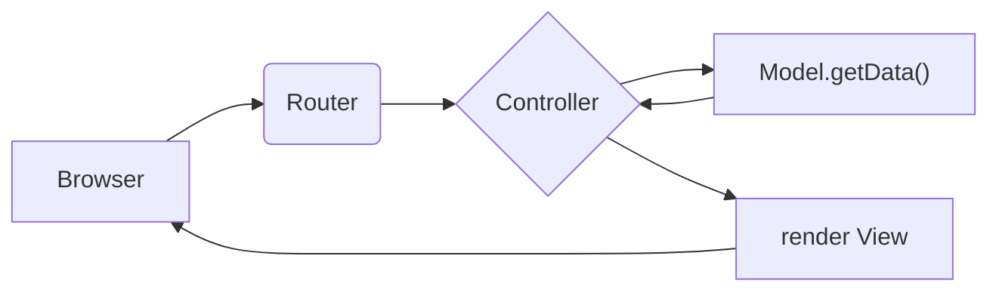
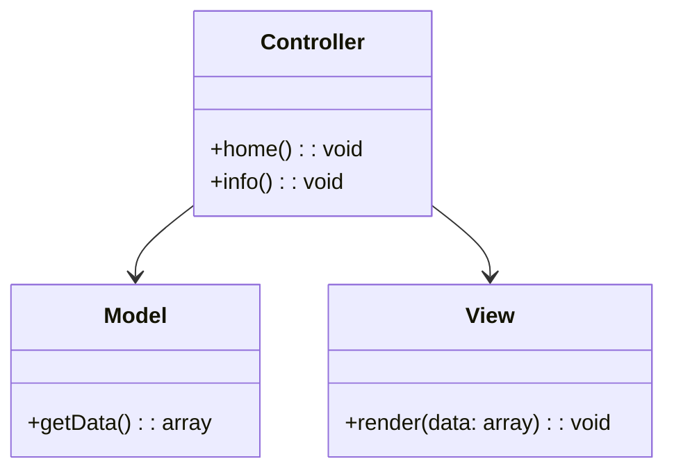

# Mini-MVC em PHP

Este projeto demonstra o padrão Model-View-Controller (MVC) em um único arquivo PHP, servindo como guia educativo.

## Sumário
- [1. O que é MVC e por que usar](#1-o-que-é-mvc-e-por-que-usar)
- [2. Exemplo micro-MVC em único arquivo](#2-exemplo-micro-mvc-em-unico-arquivo)
- [3. Explicação passo a passo](#3-explicação-passo-a-passo)
- [4. Diagramas](#4-diagramas-educativos-mermaid)
- [5. Como testar localmente](#5-como-testar-localmente)
- [6. Próximos passos](#6-próximos-passos)

## 1. O que é MVC e por que usar
O **MVC** (Model-View-Controller) é um padrão arquitetural que separa responsabilidades em três camadas:
- **Model**: gerencia dados e lógica de negócio  
- **View**: apresenta a interface ao usuário  
- **Controller**: recebe requisições e coordena Model e View  

Esse padrão aumenta a manutenibilidade, testabilidade e reusabilidade do código.

## 2. Exemplo micro-MVC em único arquivo

pode ser encontrado no arquivo [index.php](index.php) deste repositório.

## 3. Explicação passo a passo
1. **Model**: simula acesso a dados.  
2. **View**: gera HTML a partir dos dados.  
3. **Controller**: orquestra a lógica, chamando Model e View.  
4. **Routing**: roteia a requisição para o método correto via parâmetro `action`.

## 4. Diagramas

### Fluxograma do fluxo MVC

### Diagrama de classes

## 5. Como testar localmente
1. Salve este código como `index.php`.  
2. Coloque-o em seu servidor local (XAMPP, Docker).  
3. Acesse `http://localhost/seu-projeto/?action=home` ou `?action=info`.  

## 6. Próximos passos
- Integrar um roteador avançado.  
- Usar engine de templates (Twig, Blade).  
- Conectar a banco de dados real.  
- Implementar middleware e testes.
